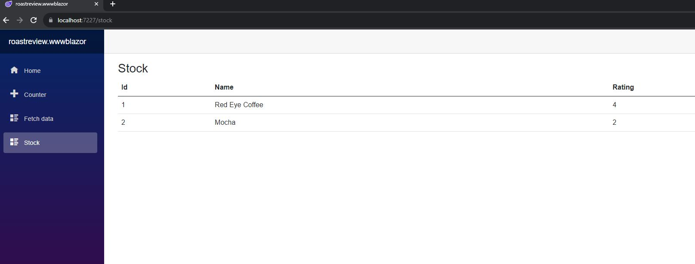

# C# Roast Review Application

## Part One
## Learning Objectives
- Understand the .Net Solution/Project layout
- dotnet command to quickly create solution and projects
- Build a  web application that consumes a data layer.

## Part Two
## Learning Objectives TBC

## Set up instructions
- Fork this repository and clone the forked version to your machine
- Open the solution file in Visual Studio.

